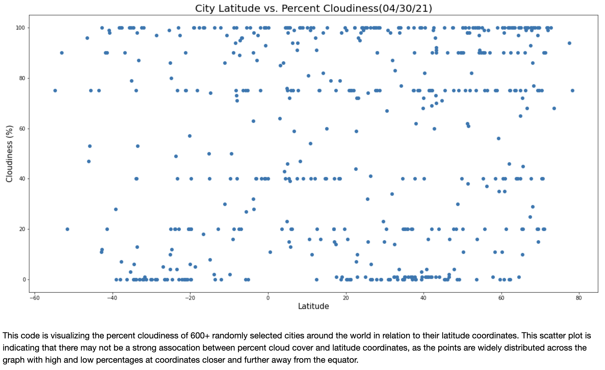
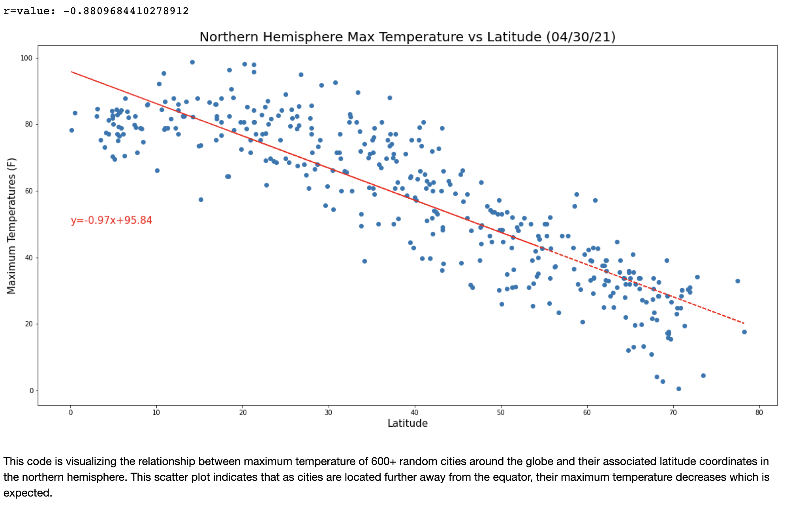

# Geographical Weather Analysis - Python API Calls

## Background Information

Whether financial, political, or social -- data's true power lies in its ability to answer questions definitively. So let's take what you've learned about Python requests, APIs, and JSON traversals to answer a fundamental question: "What's the weather like as we approach the equator?"

## Part I - WeatherPy

In this project, I created a Python script to visualize the weather of 500+ cities across the world, at varying distances from the equator. To accomplish this, I utilized a [simple Python library](https://pypi.python.org/pypi/citipy), the [OpenWeatherMap API](https://openweathermap.org/api), and critical thinking skills to create a representative model of weather across world cities.

* Initial city data retrieval using Python API calls:

### Initial Scatter Plots

The four main weather conditions that would support an investigation of climatic conditions in relation to distance from equator are Maximum Temperature, Humidity Percentage, Cloudiness Percentage, and Wind Speed. I created a series of scatter plots to showcase theserelationships, with an additional written assessment underneath each plot.

* **Temperature (F) vs. Latitude:**

* **Humidity (%) vs. Latitude**

* **Cloudiness (%) vs. Latitude**

* **Wind Speed (mph) vs. Latitude**

## Linear Regressions by Hemisphere

In order to observe any potential correlations between city latitude and weather conditions, I ran linear regressions on Maximum Temperature, Humidity, Cloudiness, and Wind Speed. This time, I separated the plots into Northern Hemisphere (greater than or equal to 0 degrees latitude) and Southern Hemisphere (less than 0 degrees latitude) in order to gain a better understanding of weather conditions in relation to a city's proximity to the Equator.

* **Northern Hemisphere - Temperature (F) vs. Latitude**

* **Southern Hemisphere - Temperature (F) vs. Latitude**

* **Northern Hemisphere - Humidity (%) vs. Latitude**

* **Southern Hemisphere - Humidity (%) vs. Latitude**

* **Northern Hemisphere - Cloudiness (%) vs. Latitude**

* **Southern Hemisphere - Cloudiness (%) vs. Latitude**

* **Northern Hemisphere - Wind Speed (mph) vs. Latitude**

* **Southern Hemisphere - Wind Speed (mph) vs. Latitude**

After each pair of plots, take the time to explain what the linear regression is modeling. For example, describe any relationships you notice and any other analysis you may have.

Your final notebook must:

* Randomly select **at least** 500 unique (non-repeat) cities based on latitude and longitude.
* Perform a weather check on each of the cities using a series of successive API calls.
* Include a print log of each city as it's being processed with the city number and city name.
* Save a CSV of all retrieved data and a PNG image for each scatter plot.

## Part II - VacationPy

Now that I've assessed weather data for 500+ cities around the globe, the next second half of this project was to display local hotels in those cities and nearby locations for a future vacation. In this portion of the assessment I utilized jupyter-gmaps and the Google Places API to generate a heat map with associated pins marking the locations of hotels around the world.

* For a global view, I generated a heat map that displays the humidity for every city from Part I, which some additional parameters to narrow down the DataFrame for "ideal weather conditions". These conditional statements included:

  * A max temperature lower than 80 degrees but higher than 70

  * Wind speed less than 10 mph

  * Zero cloudiness

  * I dropped any entries that did not meet all three weather criteria.

* The initial global humidity heat map:

  
* Using Google Places API, I was able to find the first hotel for each city located within 5000 meters of my initial coordinates.

* Display of nearest hotels:

* Finally, I generated Google Map pins containing the **Hotel Name**, **City**, and **Country** for each coordinate, and overlayed them overtop of my humidity heat map.

  

As final considerations:

* You must complete your analysis using a Jupyter notebook.
* You must use the Matplotlib or Pandas plotting libraries.

* In building your script, pay attention to the cities you are using in your query pool. Are you getting coverage of the full gamut of latitudes and longitudes? Or are you simply choosing 500 cities concentrated in one region of the world? Even if you were a geographic genius, simply rattling 500 cities based on your human selection would create a biased dataset. Be thinking of how you should counter this. (Hint: Consider the full range of latitudes).

* Once you have computed the linear regression for one chart, the process will be similar for all others. As a bonus, try to create a function that will create these charts based on different parameters.

* Remember that each coordinate will trigger a separate call to the Google API. If you're creating your own criteria to plan your vacation, try to reduce the results in your DataFrame to 10 or fewer cities.

### Copyright

Trilogy Education Services © 2020. All Rights Reserved.
