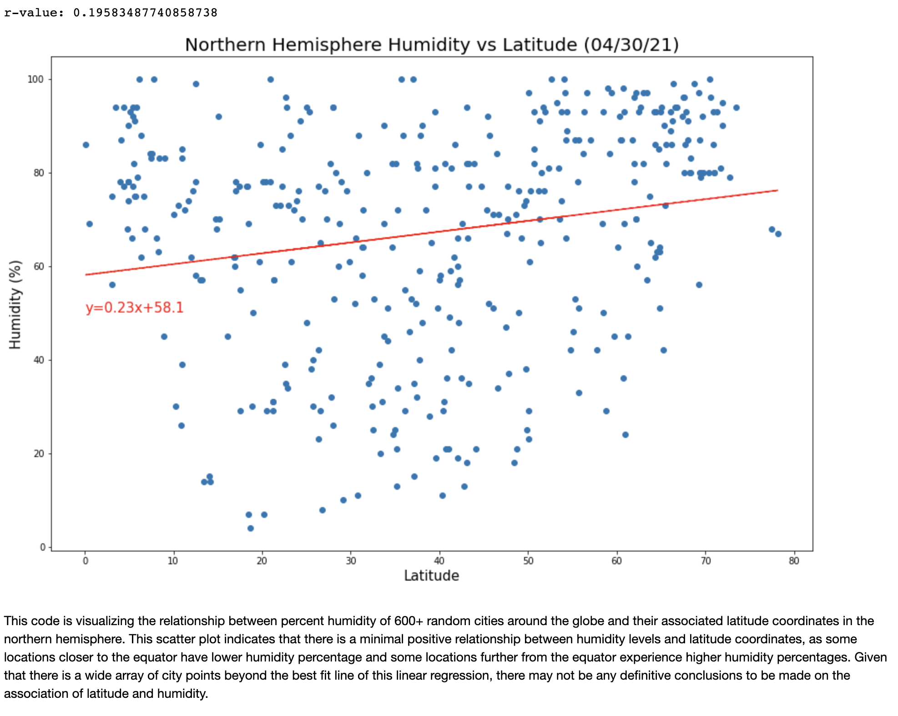
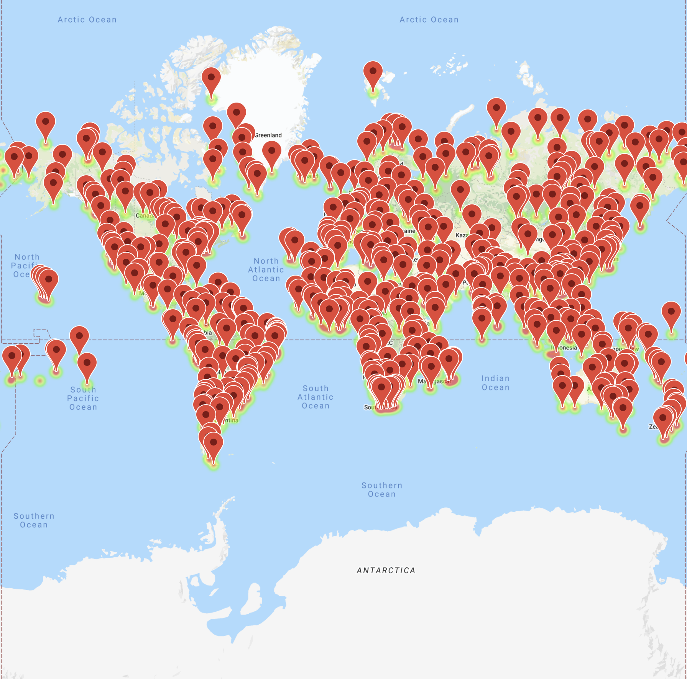

# Geographical Weather Analysis - Python API Calls

## Background Information

Whether financial, political, or social -- data's true power lies in its ability to answer questions definitively. So let's take what you've learned about Python requests, APIs, and JSON traversals to answer a fundamental question: "What's the weather like as we approach the equator?"

* Programming dependencies and languages used within this repository include: Python, Jupyter Notebook, Pandas, OpenWeather API, and Google Places API.

## Part I - WeatherPy

In this project, I created a Python script to visualize the weather of 500+ cities across the world, at varying distances from the equator. To accomplish this, I utilized a [simple Python library](https://pypi.python.org/pypi/citipy), the [OpenWeatherMap API](https://openweathermap.org/api), and critical thinking skills to create a representative model of weather across world cities.

* Initial city data retrieval using Python API calls:

### Initial Scatter Plots

The four main weather conditions that would support an investigation of climatic conditions in relation to distance from equator are Maximum Temperature, Humidity Percentage, Cloudiness Percentage, and Wind Speed. I created a series of scatter plots to showcase theserelationships, with an additional written assessment underneath each plot.

* **Temperature (F) vs. Latitude:**

* **Humidity (%) vs. Latitude**

* **Cloudiness (%) vs. Latitude**

* **Wind Speed (mph) vs. Latitude**

## Linear Regressions by Hemisphere

In order to observe any potential correlations between city latitude and weather conditions, I ran linear regressions on Maximum Temperature, Humidity, Cloudiness, and Wind Speed. This time, I separated the plots into Northern Hemisphere (greater than or equal to 0 degrees latitude) and Southern Hemisphere (less than 0 degrees latitude) in order to gain a better understanding of weather conditions in relation to a city's proximity to the Equator.

* **Northern Hemisphere - Temperature (F) vs. Latitude**

* **Southern Hemisphere - Temperature (F) vs. Latitude**

* **Northern Hemisphere - Humidity (%) vs. Latitude**

* **Southern Hemisphere - Humidity (%) vs. Latitude**

* **Northern Hemisphere - Cloudiness (%) vs. Latitude**

* **Southern Hemisphere - Cloudiness (%) vs. Latitude**

* **Northern Hemisphere - Wind Speed (mph) vs. Latitude**

* **Southern Hemisphere - Wind Speed (mph) vs. Latitude**

## Part II - VacationPy

Now that I've assessed weather data for 500+ cities around the globe, the next second half of this project was to display local hotels in those cities and nearby locations for a future vacation. In this portion of the assessment I utilized jupyter-gmaps and the Google Places API to generate a heat map with associated pins marking the locations of hotels around the world.

* For a global view, I generated a heat map that displays the humidity for every city from Part I, which some additional parameters to narrow down the DataFrame for "ideal weather conditions". These conditional statements included:

  * A max temperature lower than 80 degrees but higher than 70

  * Wind speed less than 10 mph

  * Zero cloudiness

  * I dropped any entries that did not meet all three weather criteria.

* The initial global humidity heat map:

  
* Using Google Places API, I was able to find the first hotel for each city located within 5000 meters of my initial coordinates.

* Display of nearest hotels:

* Finally, I generated Google Map pins containing the **Hotel Name**, **City**, and **Country** for each coordinate, and overlayed them overtop of my humidity heat map.

  

## Final Vacation Analysis

At the end of this project, I generated a written analytical summary covering some conclusions that could be determined based off of both the generated weather analyses as well as the hotel locations around the world. This written analysis is attached below and at the beginning of the Jupyter Notebook for `WeatherPy`. Ultimately, these conclusions deduced important factors to consider when planning a vacation relative to weather condiitons such as temperature, humidity, cloudiness, and wind speed -- all of which may be relative to the destination proximity to the Equator.

### Copyright

Trilogy Education Services © 2020. All Rights Reserved.
